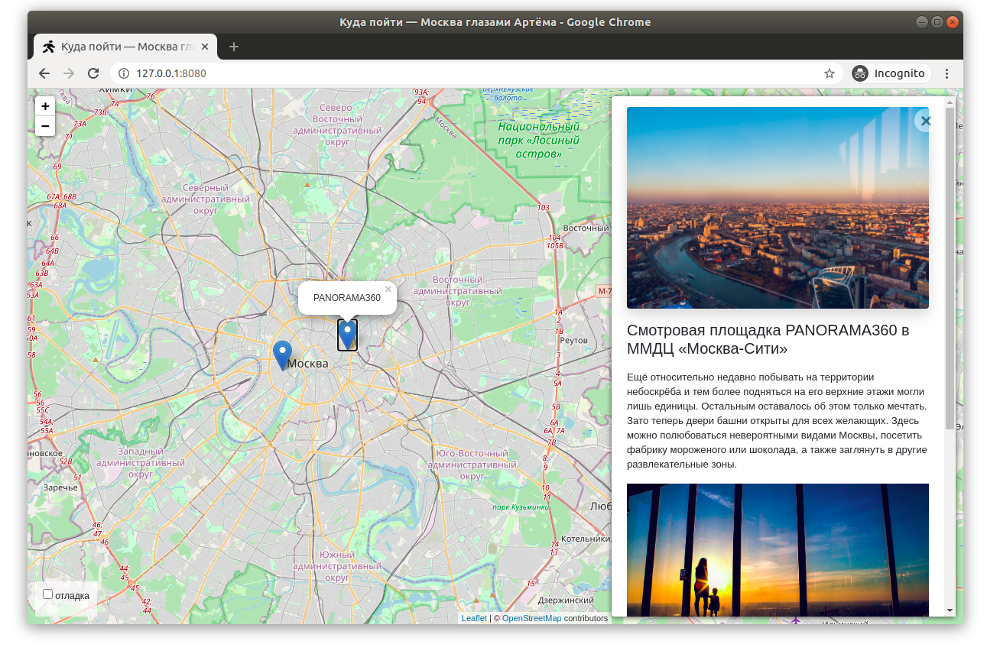

# Куда пойти — Москва глазами Артёма

Сайт о самых интересных местах в Москве. Авторский проект Артёма.



[Демка сайта](http://weatherhz.pythonanywhere.com/).
[Админка сайта](http://weatherhz.pythonanywhere.com/admin/) (login, password: admin/123456$).

## Как запустить

* Скачайте код
*  Для работы сайта необходим установленный интерпретатор Python3.6. Затем загрузите зависимости с помощью "pip"
(либо "pip3", в случае конфликтов с Python2):
```
pip install -r requirements.txt
```
* Создать миграции
```bash
$ python manage.py makemigrations
```
* Применить миграции
```bash
$ python manage.py migrate
```
* Запустите веб-сервер
```bash
$ python manage.py runserver
```
* Откройте сайт в браузере по адресу [127.0.0.0:8000](http://127.0.0.0:8000)

## Настройки

Внизу справа на странице можно включить отладочный режим логгирования.


Настройки сохраняются в Local Storage браузера и не пропадают после обновления страницы. Чтобы сбросить настройки удалите ключи из Local Storage с помощью Chrome Dev Tools —&gt; Вкладка Application —&gt; Local Storage.

Если что-то работает не так, как ожидалось, то начните с включения отладочного режима логгирования.

<a href="#" id="data-sources"></a>

## Источники данных

Фронтенд получает данные из двух источников. Первый источник — это JSON, запечённый внутрь HTML. Он содержит полный список объектов на карте. И он прячется внутри тега `script`:

```javascript
<script id="places-geojson" type="application/json">
  {
    "type": "FeatureCollection",
    "features": [
      {
        "type": "Feature",
        "geometry": {
          "type": "Point",
          "coordinates": [37.62, 55.793676]
        },
        "properties": {
          // Специфичные для этого сайта данные
          "title": "Легенды Москвы",
          "placeId": "moscow_legends",
          "detailsUrl": "./places/moscow_legends.json"
        }
      },
      // ...
    ]
  }
</script>
```

При загрузке страницы JS код ищет тег с id `places-geojson`, считывает содержимое и помещает все объекты на карту.

Данные записаны в [формате GeoJSON](https://ru.wikipedia.org/wiki/GeoJSON). Все поля здесь стандартные, кроме `properties`. Внутри `properties` лежат специфичные для проекта данные:

* `title` — название локации
* `placeId` — уникальный идентификатор локации, строка или число
* `detailsUrl` — адрес для скачивания доп. сведений о локации в JSON формате

Значение поля `placeId` может быть либо строкой, либо числом. Само значение не играет большой роли, важна лишь чтобы оно было уникальным. Фронтенд использует `placeId` чтобы избавиться от дубликатов — если у двух локаций одинаковый `placeId`, то значит это одно и то же место.

Второй источник данных — это те самые адреса в поле `detailsUrl` c подробными сведениями о локации. Каждый раз, когда пользователь выбирает локацию на карте JS код отправляет запрос на сервер и получает картинки, текст и прочую информацию об объекте. Формат ответа сервера такой:

```javascript
{
    "title": "Экскурсионный проект «Крыши24.рф»",
    "imgs": [
        "https://kudago.com/media/images/place/d0/f6/d0f665a80d1d8d110826ba797569df02.jpg",
        "https://kudago.com/media/images/place/66/23/6623e6c8e93727c9b0bb198972d9e9fa.jpg",
        "https://kudago.com/media/images/place/64/82/64827b20010de8430bfc4fb14e786c19.jpg",
    ],
    "description_short": "Хотите увидеть Москву с высоты птичьего полёта?",
    "description_long": "<p>Проект «Крыши24.рф» проводит экскурсии ...</p>",
    "coordinates": {
        "lat": 55.753676,
        "lng": 37.64
    }
}
```

## Работа с admin панелью

Для того, чтобы начать работу с базой данных контента на сайте, Вам нужно провести ряд процедур:

* Создать пользователя-администратора
```bash
$ python manage.py createsuperuser
```
* Далее следовать подсказкам в консоли (придумать логин, указать адрес почты, дважды ввести пароль)
* Перейти по адресу [http://127.0.0.0:8000/admin](http://127.0.0.0:8000/admin)
* Ввести логин и пароль пользователя

admin панель позволяет добавлять новые места на сайт. Переходите в Places и нажимайте создать новый.
Здесь вы можете заполнить информацию о месте. (Обязательные поля выделены жирным шрифтом)
Ниже представлен удобный интерфейс загрузки изображений. После загрузки вы можете менять местами изображения,
просто перетаскивая их за левую часть. Тем самым меняется их порядок отображения на сайте.

## Импорт данных

Для импорта данных в системе предусмотрена консольная команда:
```bash
$ python manage.py load_place url
```

где url это ссылка на json файл в формате `detailsUrl`,
например, [Антикафе Bizone.json](https://raw.githubusercontent.com/devmanorg/where-to-go-places/master/places/%D0%90%D0%BD%D1%82%D0%B8%D0%BA%D0%B0%D1%84%D0%B5%20Bizone.json) 


## Используемые библиотеки

* [Django](https://www.djangoproject.com/) — backend сайта
* [Leaflet](https://leafletjs.com/) — отрисовка карты
* [loglevel](https://www.npmjs.com/package/loglevel) для логгирования
* [Bootstrap](https://getbootstrap.com/) — CSS библиотека
* [Vue.js](https://ru.vuejs.org/) — реактивные шаблоны на фронтенде

## Цели проекта

Код написан в учебных целях — это урок в курсе по Python и веб-разработке на сайте [Devman](https://dvmn.org).

Тестовые данные взяты с сайта [KudaGo](https://kudago.com).

